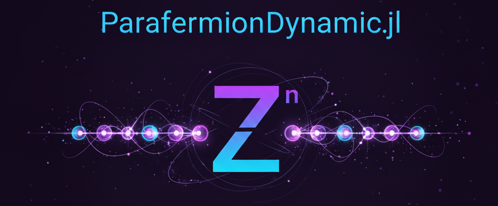

# ParafermionDynamic



A Julia package for simulating the dynamics of Zₙ parafermions in one-dimensional chains using exact diagonalization and Krylov subspace methods.

[](https://yourusername.github.io/ParafermionDynamic.jl/stable)
[](https://yourusername.github.io/ParafermionDynamic.jl/dev)
[](https://github.com/javahedi/ParafermionDynamic.jl/actions/workflows/CI.yml?query=branch%3Amain)
[](https://codecov.io/gh/yourusername/ParafermionDynamic.jl)


## Overview

ParafermionDynamic.jl provides tools for studying the quantum dynamics of Zₙ parafermionic systems, which are generalizations of Majorana fermions to higher dimensions. The package includes:

- **Basis construction** for Zₙ Hilbert spaces with sector conservation
- **Hamiltonian construction** for parafermion chains with various interactions
- **Time evolution** using Krylov subspace methods
- **Observables computation** for studying dynamics and correlations
- **Initial state preparation** for common configurations

## Installation

```julia
] add ParafermionDynamic
```

Or for the latest development version:

```julia
] add https://github.com/javahedi/ParafermionDynamic.jl
```

## Quick Start

```julia
using ParafermionDynamic

# Build a Z₃ parafermion chain with 8 sites
L = 8
n = 3
hopping = [(i, i+1, 1.0) for i in 0:L-2]  # Nearest-neighbor hopping

model = build_model(L; n=n, hopping=hopping, mu=zeros(L))

# Create initial state with excitation in the middle
middle = div(L, 2)
s0 = polarized_state(L, n, 0)  # All sites at 0
s0 = set_digit!(s0, middle, 1, n)  # Excited middle site

# Initialize state vector
ψ0 = zeros(ComplexF64, length(model.states))
ψ0[model.idxmap[s0]] = 1.0

# Time evolution parameters
dt = 0.1
steps = 50

# Store observables
occupations = zeros(Float64, L, steps+1)
occupations[:, 1] = local_occupation(ψ0, model)

# Time evolution loop
ψt = copy(ψ0)
for t in 1:steps
    ψt = krylov_time_evolve(ψt, dt, apply_H!, model; kry_m=20)
    occupations[:, t+1] = local_occupation(ψt, model)
end
```

## Features

### Hamiltonian Terms

The package supports various Hamiltonian terms for Zₙ parafermions:

- **Single-particle hopping**: $J_{ij} B_i^\dagger B_j$
- **Two-particle hopping**: $g_{ij} B_i^{\dagger 2} B_j^2$ 
- **Onsite potential**: $\mu_j N_j$
- **ZZ couplings**: $J_z Z_i Z_j^\dagger$

### Initial States

Common initial state preparations:

- `polarized_state(L, n, val)`: All sites in state `val`
- `neel_state(L, n; pattern=[0,1])`: Alternating pattern
- `random_sector_state(L, n, sector)`: Random state in given symmetry sector

### Observables

- `local_occupation(ψ, model)`: Site-resolved occupation numbers
- `local_B(ψ, model)`: B operator expectations
- `two_site_corr(ψ, model, i, j)`: Two-site correlations
- `structure_factor_qt(ψ0, ψt, model, q)`: Momentum-space structure factor
- `autocorrelation(ψ0, ψt, model)`: Site-averaged autocorrelation

### Time Evolution

- **Krylov subspace method** with adjustable subspace size
- **Exact Hamiltonian application** with efficient basis encoding
- **Thread-parallel implementation** for large systems

## Theory Background

Zₙ parafermions are generalizations of Majorana fermions that satisfy:

$$
\psi_i \psi_j = \omega^{\text{sgn}(j-i)} \psi_j \psi_i \quad \text{for } i \neq j
$$

where $\omega = e^{2\pi i/n}$. The package uses the B-Z representation where:

- $B_j$ are parafermion annihilation operators
- $Z_j$ are clock operators satisfying $Z_j^n = 1$
- The Hilbert space has local dimension $n$

## Examples

See the `examples/` directory for:

- `example1.jl`: Basic time evolution with local excitation
- `example2.jl`: Sector-restricted dynamics

## Performance

- **Efficient basis encoding** using base-n digit representation
- **Thread-parallel Hamiltonian application** 
- **Krylov subspace optimization** for long-time evolution
- **Memory-efficient storage** of basis states

For systems up to ~12 sites with n=3, exact diagonalization is feasible. For larger systems, the Krylov method enables efficient time evolution.

## API Reference

### Main Modules

- `BasisZn`: Zₙ basis construction and manipulation
- `ParafermionModel`: Model definition and Hamiltonian terms
- `Hamiltonian`: Hamiltonian application and time evolution
- `InitialStates`: Common initial state preparations  
- `Observables`: Measurement operators and correlation functions
- `Krylov`: Krylov subspace time evolution methods

### Key Functions

```julia
# Model construction
model = build_model(L; n=3, hopping=[], pair_hopping=[], mu=[], zz=[])

# Basis operations
states, idxmap = build_full_basis(L, n)
states, idxmap = build_sector_basis(L, n, sector)

# Time evolution
ψt = krylov_time_evolve(ψ0, dt, apply_H!, model; kry_m=30)

# Measurements
occ = local_occupation(ψ, model)
corr = two_site_corr(ψ, model, i, j)
```

## Contributing

Contributions are welcome! Please feel free to submit pull requests or open issues for bugs and feature requests.

## Citation

If you use this package in your research, please cite:

```bibtex
@software{ParafermionDynamic2024,
  author = {Javad Vahedi},
  title = {ParafermionDynamic.jl: A Julia package for Zₙ parafermion dynamics},
  year = {2024},
  url = {https://github.com/yourusername/ParafermionDynamic.jl}
}
```

## License

This project is licensed under the MIT License - see the [LICENSE](LICENSE) file for details.


---

For questions and discussions, please open an issue or contact the maintainers.
