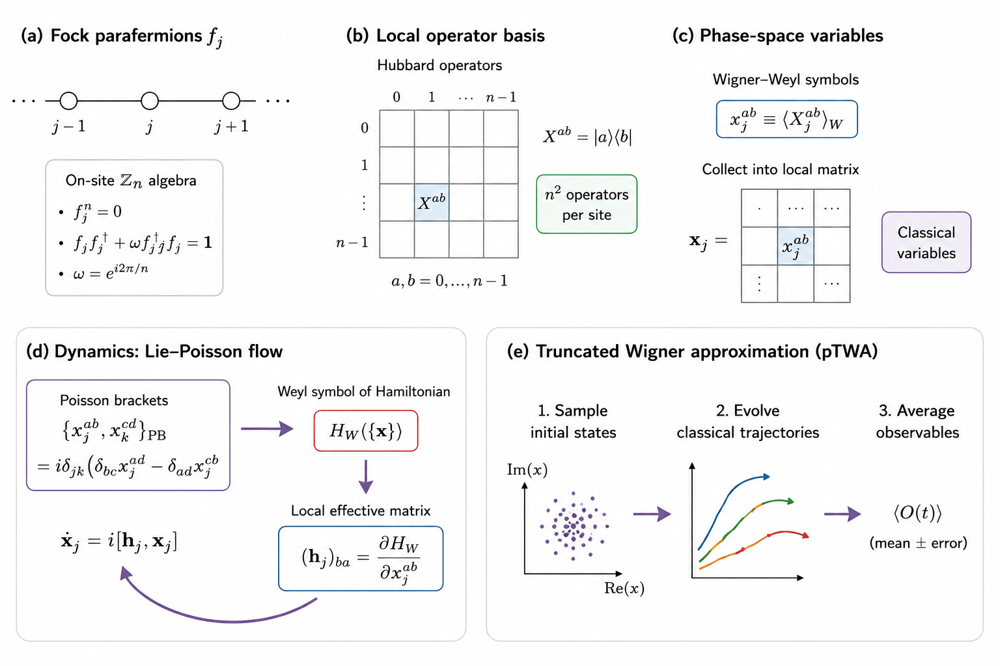
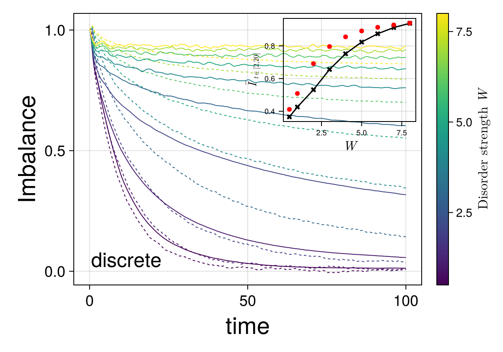

# Parafermionic Truncated Wigner Approximation

<p align="center">
  
</p>

<p align="center">
  <b>Semiclassical phase-space dynamics for interacting parafermionic quantum systems</b>
</p>

<p align="center">
  <a href="https://arxiv.org/abs/2603.29344">
    
  </a>
  
  
</p>

---

## About

This repository contains the numerical codes and figure-reproduction
scripts accompanying

> **Parafermionic Truncated Wigner Approximation**  
> Javad Vahedi and Martin Gärttner  
> arXiv:2603.29344 (2026)

**Paper:** https://arxiv.org/abs/2603.29344

We develop a **parafermionic truncated Wigner approximation (pTWA)** for
semiclassical simulations of parafermionic quantum many-body dynamics.

The approach maps the local parafermionic degrees of freedom to a Hubbard
operator basis and represents the resulting local operator algebra by
classical phase-space variables. Quantum fluctuations of the initial state
are incorporated through stochastic Wigner sampling, after which the
phase-space variables evolve according to classical Lie–Poisson equations.

The method provides a scalable route to studying nonequilibrium dynamics
in parafermionic and generalized \(\mathbb Z_n\) systems beyond system
sizes accessible to exact many-body simulations.

---

## Reproducing the figures

The repository is organized **figure by figure**. Each `Fig*` directory is
intended to be self-contained and contains the scripts, sampling routines,
checks, and plotting code needed for that figure.

```text
.
├── Fig1_Schematic/
│   └── Fig0_Schematic_v2.png
│
├── Fig2_lmg/
│   └── ...
│
├── Fig3_Z3_heatmaps/
│   └── ...
│
├── Fig4_dynamics_Z3/
│   └── ...
│
├── Fig5_Imbalance_L12/
│   └── ...
│
├── Fig6-Zn/
│   └── ...
└── 
```

The numerical benchmarks include comparisons of pTWA with exact or
tensor-network calculations for several parafermionic models and
observables.

### Typical workflow

Enter the directory of the figure that you want to reproduce:

```bash
cd Fig3_Z3_heatmaps
```

Instantiate its Julia environment:

```bash
julia --project=. -e 'using Pkg; Pkg.instantiate()'
```

Then follow the `README.md` contained in that directory. A typical figure
folder provides separate scripts for

```text
sampling / sampling checks
        ↓
quantum benchmark
        ↓
pTWA simulation
        ↓
consistency checks
        ↓
final plot
```

This organization is intentional: numerical data for one figure can be
regenerated and checked without depending on scripts from another figure.

---

## pTWA in a nutshell

For local Hubbard operators

$$X_j^{ab}=|a\rangle_j\langle b|,$$

the local operator algebra is

$$[X^{ab},X^{cd}]=\delta_{bc}X^{ad}-\delta_{ad}X^{cb}.$$

Introducing phase-space variables \(x_j^{ab}\), the corresponding
Lie–Poisson structure is

$$\{x_j^{ab},x_k^{cd}\}=i\delta_{jk}\left(\delta_{bc}x_j^{ad}-\delta_{ad}x_j^{cb}\right).$$

Writing

$$(\mathbf h_j)_{ba}=\frac{\partial H_W}{\partial x_j^{ab}},$$

the pTWA equations of motion take the compact matrix form

$$\dot{\mathbf x}_j=i[\mathbf x_j,\mathbf h_j].$$

The initial quantum fluctuations are represented by stochastic sampling
of the phase-space variables. The repository contains implementations of
the sampling schemes used for the numerical benchmarks in the paper.

---

## Example: disordered parafermion dynamics

The codes include disorder-averaged simulations of domain-wall relaxation
in the interacting \(\mathbb Z_3\) Fock-parafermion chain.

<p align="center">
  
</p>

The comparison illustrates how pTWA captures the strong dependence of the
relaxation dynamics on disorder strength while remaining applicable to
many stochastic trajectories and disorder realizations.

---

## Computational philosophy

The implementation exploits the local Hubbard-operator representation.
For a chain of \(N\) sites with local Hilbert-space dimension \(n\), pTWA
evolves an \(n\times n\) phase-space matrix on every site.

The dynamical state therefore requires 

$$
\mathcal O(Nn^2)
$$

variables. For local interactions the equations of motion scale linearly
with system size \(N\) at fixed \(n\), while dense local matrix operations
have a generic \(\mathcal O(n^3)\) cost.

Most importantly, different stochastic trajectories are independent and
can be parallelized straightforwardly.

---

## Citation

If this code or the pTWA approach is useful for your work, please cite:

```bibtex
@misc{vahedi2026parafermionictruncatedwignerapproximation,
      title        = {Parafermionic Truncated Wigner Approximation},
      author       = {Javad Vahedi and Martin G{\"a}rttner},
      year         = {2026},
      eprint       = {2603.29344},
      archivePrefix= {arXiv},
      primaryClass = {cond-mat.str-el},
      url          = {https://arxiv.org/abs/2603.29344}
}
```

---

## Authors

**Javad Vahedi** and **Martin Gärttner**

For details of the formalism, numerical benchmarks, and physical
applications, see the accompanying paper:

**[Parafermionic Truncated Wigner Approximation — arXiv:2603.29344](https://arxiv.org/abs/2603.29344)**

---

<p align="center">
  <b>Parafermionic quantum dynamics → local phase space → stochastic semiclassical evolution</b>
</p>